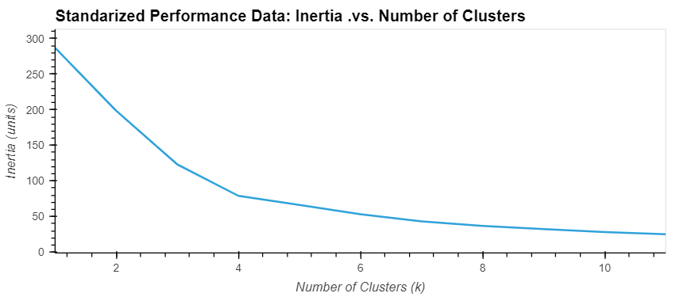

# Unsupervised Learning - CryptoClustering

This project allowed me to use my knowledge of Python and unsupervised learning to predict if cryptocurrencies are affected by 24-hour or 7-day price changes.

## Instructions

* Rename the Crypto_Clustering_starter_code.ipynb file as Crypto_Clustering.ipynb.

* Load the crypto_market_data.csv into a DataFrame.

* Get the summary statistics and plot the data to see what the data looks like before proceeding.

## Prepare the Data

* Use the **StandardScaler()** module from **scikit-learn** to normalize the data from the CSV file.

* Create a DataFrame with the scaled data and set the **coin_id** index from the original DataFrame as the index for the new DataFrame.

    * The first five rows of the scaled DataFrame should appear as follows:

        

    * Create a scatter plot using hvPlot by setting `x="price_change_percentage_24h"` and `y="price_change_percentage_7d"`. 

    * Color the graph points with the labels found using K-Means and the crypto name in the `hover_cols` parameter to identify the cryptocurrency represented by each data point.

        
        

## Find the Best Value for k Using the Original Scaled DataFrame

* Use the elbow method to find the best value for k using the following steps:

   * Create a list with the number of k values from 1 to 11.

   * Create an empty list to store the inertia values.

   * Create a for loop to compute the inertia with each possible value of k.

   * Create a dictionary with the data to plot the elbow curve.

   * Plot a line chart with all the inertia values computed with the different values of k to visually identify the optimal value for k.

        

   * Answer the following question in your notebook: What is the best value for k? 

## Cluster Cryptocurrencies with K-means Using the Original Scaled Data

* Use the following steps to cluster the cryptocurrencies for the best value for k on the original scaled data:

    * Initialize the K-means model with the best value for k.

    * Fit the K-means model using the original scaled DataFrame.

    * Predict the clusters to group the cryptocurrencies using the original scaled DataFrame.

    * Create a copy of the original data and add a new column with the predicted clusters.

    * Create a scatter plot using hvPlot as follows:

        * Set the x-axis as "price_change_percentage_24h" and the y-axis as "price_change_percentage_7d".

        * Color the graph points with the labels found using K-means.

        * Add the "coin_id" column in the hover_cols parameter to identify the cryptocurrency represented by each data point.

        
        

## Optimize Clusters with Principal Component Analysis

*  Using the original scaled DataFrame, perform a PCA and reduce the features to three principal components.

* Retrieve the explained variance to determine how much information can be attributed to each principal component and then answer the following question in your notebook: What is the total explained variance of the three principal components? About 89% of the total variance is condensed into the 3 principal components.

* Create a new DataFrame with the PCA data and set the "coin_id" index from the original DataFrame as the index for the new DataFrame.

* The first five rows of the PCA DataFrame should appear as follows:

    
        

## Find the Best Value for k Using the PCA Data

* Use the elbow method on the PCA data to find the best value for k using the following steps:

* Create a list with the number of k-values from 1 to 11.

* Create an empty list to store the inertia values.

* Create a for loop to compute the inertia with each possible value of k.

* Create a dictionary with the data to plot the Elbow curve.

* Plot a line chart with all the inertia values computed with the different values of k to visually identify the optimal value for k.

    

* Answer the following question in your notebook:

    * What is the best value for k when using the PCA data? 

    * Does it differ from the best k value found using the original data? 

## Cluster Cryptocurrencies with K-means Using the PCA Data

* Use the following steps to cluster the cryptocurrencies for the best value for k on the PCA data:

* Initialize the K-means model with the best value for k.

* Fit the K-means model using the PCA data.

* Predict the clusters to group the cryptocurrencies using the PCA data.

* Create a copy of the DataFrame with the PCA data and add a new column to store the predicted clusters.

* Create a scatter plot using hvPlot as follows:

    * Set the x-axis as "price_change_percentage_24h" and the y-axis as "price_change_percentage_7d".
    * Color the graph points with the labels found using K-means.
    * Add the "coin_id" column in the hover_cols parameter to identify the cryptocurrency represented by each data point.
    * Answer the following question: What is the impact of using fewer features to cluster the data using K-Means?

    

## Visualize and Compare the Results

* In this section, you will visually analyze the cluster analysis results by contrasting the outcome with and without using the optimization techniques.

    

* Create a composite plot to contrast the clusters.

    

* Answer the following question on your notebook: After visually analyzing the cluster analysis results, what is the impact of using fewer features to cluster the data using K-Means?

## References

Data for this dataset was generated by edX Boot Camps LLC, and is intended for educational purposes only.
